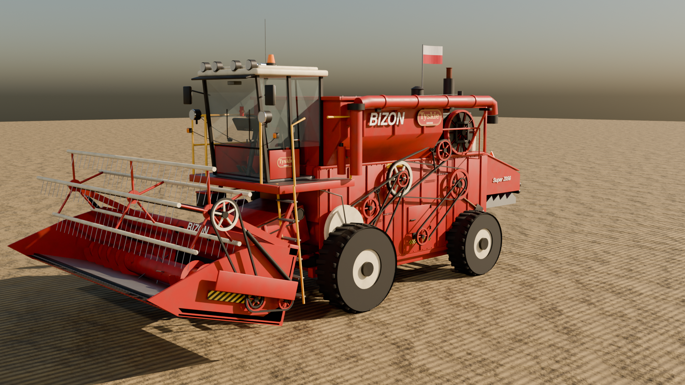

# Bizon Super Z056 — mod do Farming Simulator 25

Stary, czerwony Bizon z Płocka z hederem 4,2 m, zbudowany w Blenderze (skrypt Python = to samo,
co robi Blender MCP) i wyeksportowany do natywnego formatu GIANTS (`.i3d` + binarne `.i3d.shapes`).



## Instalacja

1. Pobierz `dist/FS25_BizonSuperZ056.zip`.
2. Wrzuć **spakowany** zip (nie rozpakowuj) do
   `Dokumenty\My Games\FarmingSimulator2025\mods`.
3. W grze włącz mod w wyborze modów zapisu. W sklepie: marka **Bizon** →
   *Super Z056* (Kombajny) i *Heder zbożowy 4,2 m* (Hedery).

## Co jest w środku

Kombajn:
- silnik SW-400 105 KM, w konfiguracji opcjonalnie SW-680 150 KM; napęd na przód, skrętna tylna oś,
- zbiornik 3200 l, rura wyładowcza rozkładana animacją z siłownikiem hydraulicznym, efekt zboża z rury,
- **po odpaleniu**: trzęsie się silnik i cała maszyna (drgania od pracy silnika), kręci się sito obrotowe
  chłodnicy, koła pasowe alternatora/wentylatora, czarny dym z wydechu,
- **przy młóceniu**: kręcą się wszystkie koła pasowe po lewej stronie (wariator bębna, wał pośredni,
  wentylator, korba wytrząsaczy, sita), zębatki podajnika i elewatora, ślimak w zbiorniku,
  wytrząsacze chodzą po okręgu w dwóch fazach jak na wale korbowym,
- przenośnik pochyły podnoszony siłownikami (siłowniki śledzą ruch), podnoszenie/opuszczanie hedera,
- kabina: kierownica obracana przy skręcaniu, zegary obrotów i prędkości z działającymi wskazówkami,
  kluczyk, dźwignie, pedały, fotel z amortyzacją, postać kierowcy (IK na kierownicy i pedałach),
- oświetlenie: drogowe, długie, halogeny robocze przód/tył (lampy z biblioteki gry), światło rury,
  kierunkowskazy, stop, kogut na dachu, lampka w kabinie,
- mechanika i elektryka na wierzchu: pasy klinowe z napinaczami i sprężynami, łańcuchy, kalamitki,
  akumulator z klemami, skrzynka bezpieczników, wiązki kabli z opaskami, przewody hydrauliczne
  od rozdzielacza do siłowników, zbiornik oleju, filtr powietrza, kolektor, pompa wtryskowa, rozrusznik,
- dodatki: skrzynka piwa Tyskie z butelkami przypięta pasem na podeście, puszki w kabinie,
  lodówka turystyczna na silniku, flaga Polski na maszcie, trąbki, radio CB z anteną, gaśnica,
  łopata, klocek drewna, trójkąt pojazdu wolnobieżnego, tablica rejestracyjna, tabliczka znamionowa.

Heder 4,2 m: nagarniacz z palcami, ślimak ze zwojami i palcami, kosa z ruchem posuwisto-zwrotnym,
napęd pasowy z boku, siłowniki nagarniacza, płozy, pasy ostrzegawcze.

Tekstury drewna/metalu/gumy korzystają z biblioteki detali FS25 (`$data/shared/detailLibrary`),
więc brud, zużycie i mycie działają jak w pojazdach z gry. Opony, felgi, lampy robocze, kogut,
dym i dźwięki (silnik z pliku `.gls` z gry, szablony dźwięków) są ładowane z plików gry.

## Uczciwie: czego nie dało się sprawdzić

Mod jest zbudowany i sprawdzony **statycznie** (poprawność XML, każde `i3dMapping` wskazuje właściwy
węzeł i3d, wszystkie pliki istnieją, geometria dekoduje się dwoma niezależnymi czytnikami, a writer
`.i3d.shapes` odtwarza bajt-w-bajt oryginalne pliki FS25). **Nie był uruchomiony w samej grze** —
FS25 działa tylko na Windows/konsolach. Jeśli coś nie zagra, w `log.txt`
(`Dokumenty\My Games\FarmingSimulator2025\log.txt`) będą linie `Error:`/`Warning:` z nazwą pliku —
wklej je, poprawię.

Najbardziej prawdopodobne miejsca na drobne poprawki: rozmiar opon przednich `480_80R26` (jeśli
gra go nie znajdzie, wybierz w sklepie konfigurację kół „szerokie” 650/75R32), ustawienie wysokości
hedera, kierunki niektórych obrotów.

Mod fanowski, nieoficjalny. Napisy „Bizon” i „Tyskie” to własne liternictwo, nie oryginalne logotypy;
do użytku prywatnego (na ModHub znaki towarowe nie przejdą).

## Przebudowa

```sh
BLENDER=/ścieżka/do/blender PY=python3 sh tools/run_final.sh build/final
```

- `tools/bizon_model.py` — cały model (kombajn + heder), `tools/blender_kit.py` — prymitywy,
- `tools/i3d_export.py` — eksport Blender → i3d, `tools/i3d_shapes.py` — binarny format `.i3d.shapes`
  (test: `python tools/test_shapes_roundtrip.py <plik z gry>.i3d.shapes`),
- `tools/make_mod.py` — XML-e pojazdów, modDesc, ikony, zip; `tools/validate_mod.py` — walidacja.

Wymaga Blendera 4.2 oraz Pythona z `numpy` i `Pillow`. Plik `dist/bizonSuperZ056.blend` to gotowa
scena do podglądu/edycji w Blenderze.
