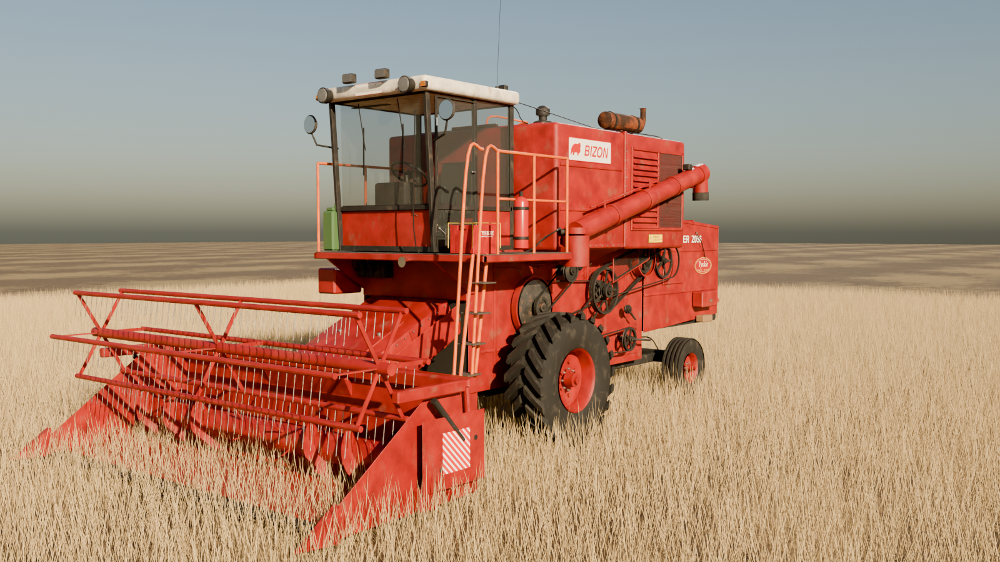
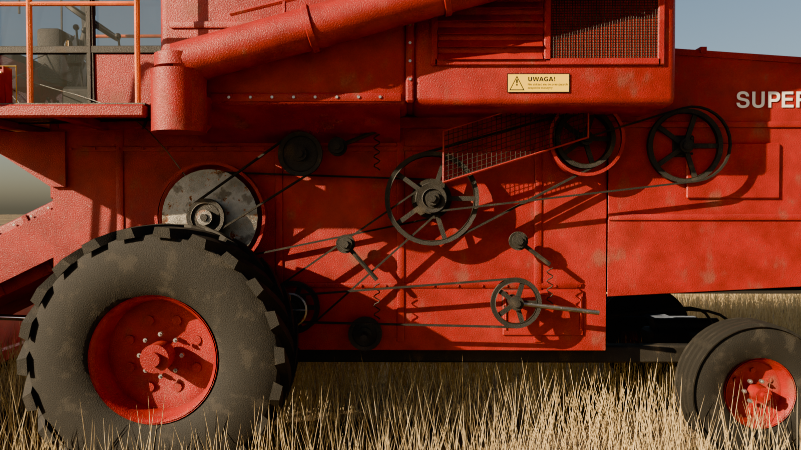
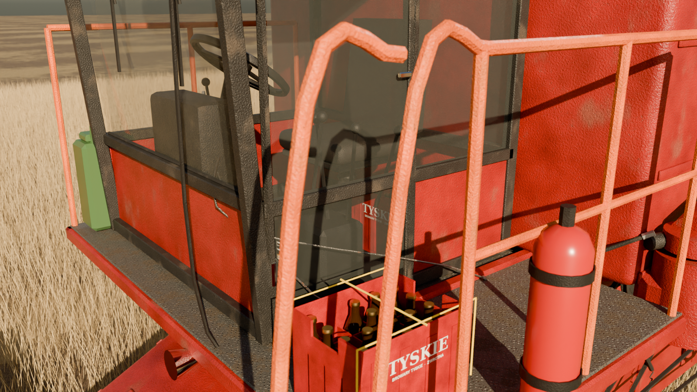
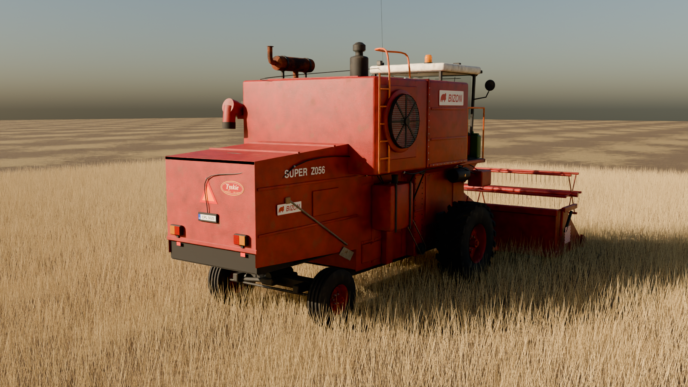

# Bizon Super Z056 — od zera (FS25)

Nowy, niezależny od reszty repozytorium model kombajnu Bizon Super Z056 (FMŻ Płock, 1976–1994)
z hederem 4,2 m. Wszystko w tym katalogu jest zrobione od początku: bryła, tekstury, dźwięki,
eksporter do formatu GIANTS i pliki XML moda. Nic nie jest kopiowane ze starszego projektu w repo.

| | |
|---|---|
|  |  |
|  | |

## Instalacja

1. Pobierz `dist/FS25_Bizon_Z056_Super.zip`.
2. Wrzuć **spakowany** zip do `Dokumenty\My Games\FarmingSimulator2025\mods`.
3. W grze zaznacz mod przy zapisie. Sklep → marka **Bizon**: *Super Z056* (Kombajny) i
   *Heder 4,2 m (Z056)* (Hedery).

## Co jest w modelu

Proporcje i układ według zdjęć prawdziwych Z056 Super (Wikimedia Commons) i danych
technicznych (SW-400 100 KM, zbiornik 30 hl, heder 4,2 m, 5 wytrząsaczy, 21 km/h):

- kabina z pochyloną szybą, białym dachem, lampami drogowymi i roboczymi, kogutem, anteną CB,
  lusterkami, wycieraczkami; w środku fotel na sprężynie, kolumna kierownicy, zegary obrotów
  i prędkości ze wskazówkami, dźwignie, pedały, gaśnica, lampka,
- pomost z blachy ryflowanej, drabinka i pomarańczowe poręcze, rozdzielacz hydrauliczny
  z przewodami pod pomostem,
- wysoki blok zbiornika ziarna i silnika: wziernik zbiornika, pokrywa z zawiasami, kołnierze
  i rzędy śrub, żaluzje i siatka po lewej (widać silnik), chłodnica z obrotowym sitem po
  prawej, siatka na dachu, tłumik z klapką, filtr powietrza mokry z odśrodkowym wstępnym,
  drabinka serwisowa na dach silnika,
- silnik rzędowy 6-cyl.: głowice, kolektory, pompa wtryskowa z przewodami, filtry, alternator,
- lewy bok: 13 kół pasowych (wariator bębna z drugą tarczą, wał pośredni, odrzutnik,
  wentylator z pokrętłem, sita, korba wytrząsaczy, ślimak), paski klinowe, napinacze ze
  sprężynami, łożyska kołnierzowe z kalamitkami, osłony półokrągłe i siatkowa,
- prawy bok: podnośnik ziarna i niedomłotów, zbiornik paliwa z opaskami, zbiornik oleju
  z wziernikiem, akumulator z klemami, łańcuch,
- tył: osłona wytrząsaczy, 5 wytrząsaczy (widać przez otwór), lampy, trójkąt, tablica,
- przenośnik pochyły z łańcuchem i siłownikami, oś napędowa ze zwolnicami, skrętna oś tylna
  z siłownikiem, opony R-1 z prawdziwym bieżnikiem, felgi z otworami i nakrętkami,
- wiązki kabli z opaskami, linki gazu i obrotomierza, przewody paliwa i hydrauliki,
- **Tyskie**: skrzynka 20 × 0,5 l w kabinie i druga przywiązana linką na pomoście (butelki
  z etykietą, etykietą na szyjce, kapslem i piwem w środku), naklejki Tyskie na boku,
  z tyłu i na zbiorniku; do tego kanister, łopata, klocek, skrzynka narzędziowa,
- heder: nagarniacz z 6 listwami palców, ślimak z przeciwbieżnymi zwojami i palcami, kosa
  z nożykami i palcami, płozy, napęd pasowy z osłoną, pasy ostrzegawcze.

## Co działa w grze

- jazda (napęd przedni, hydrostat do 21 km/h, skręt tylną osią Ackermanna), paliwo 200 l,
- odpalanie: rozrusznik → silnik; **drgania** tłumika, filtra i silnika (dwa przeciwbieżne
  mimośrody), klapka wydechu podskakuje z obrotami, kręci się sito chłodnicy,
- młócenie: kręcą się wszystkie koła pasowe po obu stronach i zębatka przenośnika,
  **wytrząsacze chodzą po okręgu** w dwóch fazach; heder: nagarniacz, ślimak i kosa,
- podnoszenie/opuszczanie przenośnika z hederem (siłowniki śledzą ruch),
- zbiornik 3000 l, rura wyładowcza obraca się na bok, rozładunek na przyczepę lub ziemię,
  pokos albo sieczkarnia,
- światła drogowe, długie, robocze przód/tył, lampa rury, stop, kierunkowskazy,
- kamera zewnętrzna i w kabinie, postać kierowcy z rękami na kierownicy,
- dźwięki: rozruch, praca silnika (wysokość za obrotami), gaszenie, młocarnia.

## Jak to jest zbudowane

`sh build.sh` (Blender 4.5 LTS, Python 3 z numpy, Pillow, scipy, ImageMagick, ffmpeg):

- `src/textures.py` — tekstury PBR z widma szumu (bezszwowe): lakier z odpryskami, rdzą,
  kurzem i rysami, stal, ocynk, guma, blacha ryflowana, winyl, plastik, atlas napisów,
- `src/model.py` + `src/kit.py` — cały model w Blenderze (bpy/bmesh, to samo API co Blender MCP),
- `src/export_scene.py` → `src/build_i3d.py` — eksport do `.i3d` i binarnego `.i3d.shapes`
  (wersja 10, jak w FS25) z gotowymi („precooked”) bryłami kolizji,
- `src/make_sounds.py` — syntezowane dźwięki starego diesla i młocarni,
- `src/make_mod.py` — XML pojazdów, modDesc, DDS z mipmapami, ikony, walidacja, zip,
- `tools/test_shapes_roundtrip.py <plik z gry>.i3d.shapes` — test zapisu.

## Uczciwie: co sprawdzone, a czego nie

Sprawdzone tutaj: zapisywarka `.i3d.shapes` odtwarza bajt w bajt oryginalny plik FS25
(`jcb/wft`), a dane kolizji liczone przez skrypt są identyczne z tymi w grze. Pliki
moda przechodzą walidację (XML, odwołania do węzłów, pliki, niezależny czytnik
`.i3d.shapes`). Ścieżki XML są wzięte z kodu FS25 v1.15 (GDN).

Nie sprawdzone: nie mam tu Windowsa ani FS25, więc mod **nie był uruchomiony w grze**.
Jeśli coś nie zadziała, wklej linie z `Dokumenty\My Games\FarmingSimulator2025\log.txt`
z nazwą `FS25_Bizon_Z056_Super` — poprawię. Ograniczenia: materiały używają domyślnego
shadera (tekstury z brudem są „wpieczone”, gra nie dokłada własnego zabrudzenia),
dźwięki są syntezowane, a rendery to Blender Cycles (w grze inne światło).

Mod fanowski, do użytku prywatnego. Napisy „Bizon”, „FMŻ” i „Tyskie” to własne
liternictwo, nie oryginalne logotypy.
